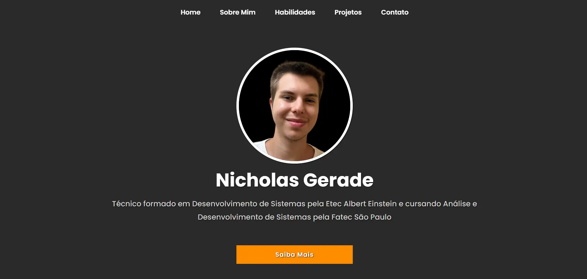

<h1 align="center"> Site Portfolio Pessoal</h1>

Portfolio Pessoal com HTML5, CSS3 e Javascript

---

 

  

---
## 💻 Tecnologias

Esse projeto foi desenvolvido com as seguintes tecnologias:

- HTML5
- CSS3
- Javascript
- Git e Github

---

## 🚧 Projeto

Este projeto foi desenvolvido inicialmente para a Matéria de ILP-540 para a Fatec São Paulo, Eletiva para Internet.
Daí decidi criar um Portfolio pessoal, não só como idéia de projeto para a matéria como também necessidade para montar
um currículo melhor e com um Portfolio de Desenvolvedor Front-end.

Você pode ver o site neste link: [Portfolio Pessoal](https://nigerade.github.io/Portfolio2.0/)

--- 
